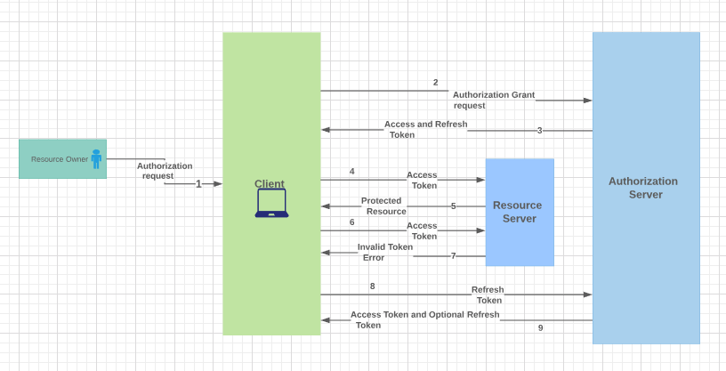
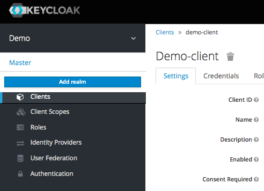
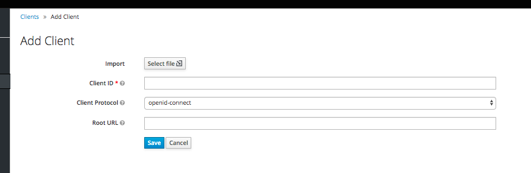
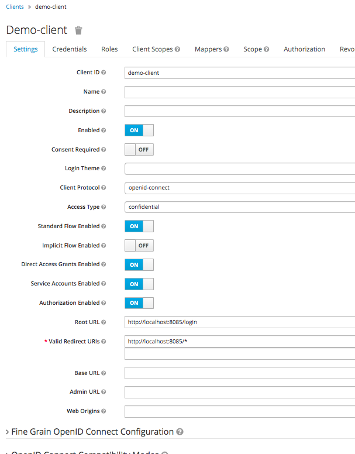
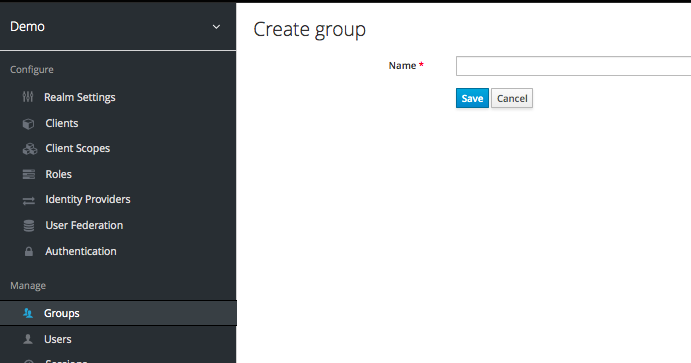
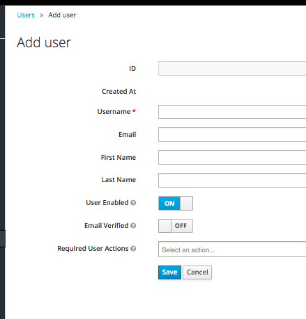
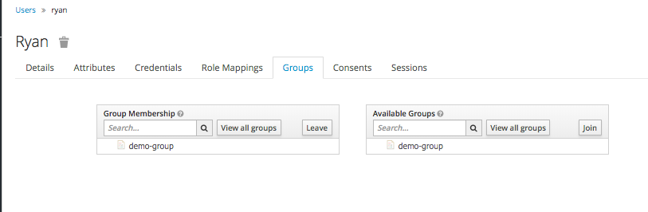

# Spring security OAuth2 with Keycloak

This example shows how to enable spring security Oauth2 with Keycloak. Will go through the
basics of Oauth2, setup Keycloak server and configure keycloak
for user authentication.

#### OAuth2
Lets understand the basics of OAuth2

OAuth defines 4 roles:

**Resource owner** - An entity capable of giving access to a protected resources.
Typically end user (you).

**Resource server** - Hosting the protected resources. What it means is
resource server will parse oauth token from the request and validate
the token and check is this token good for serving this request or not.

**Authorization server** - Responsible for issuing access tokens to the clients
after successfully authenticating the resource owner and with authorization.
   
**Client** - Application making request on behalf of `resource owner`

****

Flow diagram
 


1. User enter their credentials.
2. Client send that request to authorization server, this request includes
information like `client_id`, `client_secret`, etc.
3. Authorization server grant access token, if request is valid.
4. Now client request protected resources to resource server by passing access token.
5. Resource server validate the access token and serve the request.
6. Step 4 and 5 will continue until this access token expires.
7. Resource server will throw `Invalid Token error` when token expires.
8. When client knows access token is expired, then client send requests
to authorization server by passing refresh token to get the access token.
9. Authorization server authenticates client and validate the refresh token, if its valid
then return access token and refresh token.


#### Setup Keycloak

##### What is keycloak
Its an open source software for identity and access management. By default keycloak comes with 
embedded H2 database for persisting user data. Keycloak current supports the 
following database,

    1. Oracle
    2. SQL Server
    3. IBM DB2
    4. MySQL
    5. PostgreSQL

In this example, we use docker for starting Keycloak and PostgreSQL

To start both postgreSQL and Keycloak, execute the following command
```bash
docker-compose -f docker/docker-compose.yml up
```
Now you can go to `http://localhost:8080/` for keycloak admin console
and login as user 'admin' with password 'Pa55w0rd'.

#### Configure client and users in Keycloak

Use the following url to create a new [client]
(https://www.keycloak.org/docs/3.0/authorization_services/topics/resource-server/create-client.html)

##### Add new Realms
 

##### Add new Client
 
 
 

##### Add new Group
 
 
##### Add new User
 
 
##### Add new user to Group
 
 
http://localhost:8080/auth/realms/master/.well-known/openid-configuration

#### Spring security OAuth2 flow
When you hit the endpoint `http://localhost:8085/login` spring security framework matches 
the `DefaultLoginPageGeneratingFilter` filter and redirect the page.

TODO


