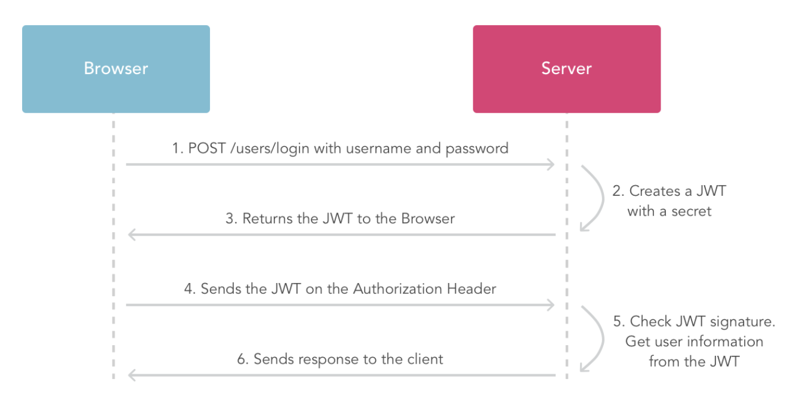

# Spring security OAuth2 with Keycloak

This example shows how to enable spring security Oauth2 with Keycloak. Will go through the
basics of Oauth2, setup Keycloak server and configure keycloak
for user authentication.

#### OAuth2
Lets understand the basics of OAuth2

OAuth defines 4 roles:

**Resource owner** - An entity capable of giving access to a protected resources.
Typically end user (you).

**Resource server** - Hosting the protected resources. What it means is
resource server will parse oauth token from the request and validate
the token and check is this token good for serving this request or not.

**Authorization server** - Responsible for issuing access tokens to the clients
after successfully authenticating the resource owner and with authorization.
   
**Client** - Application making request on behalf of `resource owner`.
e.g: Your microservice application/SPA

#### Things to remember

**Access token** - Enables client to access the protected resource if its valid.
This has a limited lifetime during this oauth2 process and this will be passed
in the HTTP request header for each request.

**Refresh token** - This has longer lifetime as compared to `Access token`. Refresh
token will use to get new `access token` when the current one has expired.
So no need to pass the credentials again to the server.

**Grant types** -Types of grant types,

    1. Authorization Code  - Typically used for web or mobile apps. 
        Used as a mediator between `client` and `resource server`. Here client   
        receives an authorization code from an authorization server and sends 
        this to the client. The client will then interact with the authorization server 
        and exchange the authorization code for access_token.
        
        In this scenario, user is redirected to authorization endpoint to grant or deny the access.
        
    2. Implicit  - In this flow, client ( java script or something) get the access token
        directly from oauth provider(ex: facebook) without the need for `authorization code`.
        Now application use this access token for subsequent calls. Implicit grant type does not
        send a refresh token to the application due to limited trust.
        
    3. Resource owner Password credentials (password) - logging with username and password and send the request
        to authorization server and authorization server validate the request and issue access token and optional
        refresh token as well. This grant is used when there is a good trust between the user and client.
    
    4. Client Credentials -  Here client can ask authorization server for access token by passing client credentails.

#### JWT(Json web token) Tokens - JSON Web Token (JWT) is a compact, URL-safe means of representing
claims to be transferred between two parties. The claims in a JWT are encoded as a JSON object that 
is used as the payload of a JSON Web Signature (JWS) structure or as the plaintext of a JSON Web Encryption (JWE) structure,
enabling the claims to be digitally signed or integrity protected with a Message Authentication Code (MAC) and/or encrypted.

**JWT Structure**
    
    1. Hearder
    2. Payload
    3. Signature
    
All these section are base64 encoded (Note -  its just encoded not encrypted)

**Header**
    ```json
    {
        "alg" : "HS256",
        "typ" : "JWT"
    }
    ```
    
**Payload** - This contains the claims, which is statement about an entity and additional data.
Three types of claims

1. Registered claims: 
    Following are the main properties
    
    ```properties
    iss - issuer
    exp - expiration time
    sub - subject
    aud - audience
    nbf - not before
    iat - issued at
    jti - jwt id
    ``` 
2. Public claims: These are documented in JWTC registry
3. Private claims: These are the custom claims to share information between parties.

**Signature** - Basically a hash of header(base64 encoded) and payload(base64 encoded) using secret.
Then finally encode the hash of the signature to get the final one.


“[Base64Encoded(HEADER)] . [Base64Encoded (PAYLOAD)] . [encoded(SIGNATURE)]”

for more details - [jwt.io](jwt.io)



#### Main configuration properties
ClientId - ID specific to your client

ClientSecret -  A secret id generated by server to initialize oauth2 process, and this should not be 
shared.

accessTokenUri - URI to get the access token
****

Flow diagram
 


1. User enter their credentials.
2. Client send that request to authorization server, this request includes
information like `client_id`, `client_secret`, etc.
3. Authorization server grant access token, if request is valid.
4. Now client request protected resources to resource server by passing access token.
5. Resource server validate the access token and serve the request.
6. Step 4 and 5 will continue until this access token expires.
7. Resource server will throw `Invalid Token error` when token expires.
8. When client knows access token is expired, then client send requests
to authorization server by passing refresh token to get the access token.
9. Authorization server authenticates client and validate the refresh token, if its valid
then return access token and refresh token.


#### Setup Keycloak

##### What is keycloak
Its an open source software for identity and access management. By default keycloak comes with 
embedded H2 database for persisting user data. Keycloak current supports the 
following database,

    1. Oracle
    2. SQL Server
    3. IBM DB2
    4. MySQL
    5. PostgreSQL

In this example, we use docker for starting Keycloak and PostgreSQL

To start both postgreSQL and Keycloak, execute the following command
```bash
docker-compose -f docker/docker-compose.yml up
```
Now you can go to `http://localhost:8080/` for keycloak admin console
and login as user 'admin' with password 'Pa55w0rd'.

#### Configure client and users in Keycloak

Use the following url to create a new [client]
(https://www.keycloak.org/docs/3.0/authorization_services/topics/resource-server/create-client.html)

##### Add new Realms
 

##### Add new Client
 
 
 

##### Add new Group
 
 
##### Add new User
 
 
##### Add new user to Group
 
 
http://localhost:8080/auth/realms/master/.well-known/openid-configuration

#### Spring security OAuth2 flow
When you hit the endpoint `http://localhost:8085/login` spring security framework matches 
the `DefaultLoginPageGeneratingFilter` filter and redirect the page.

TODO


